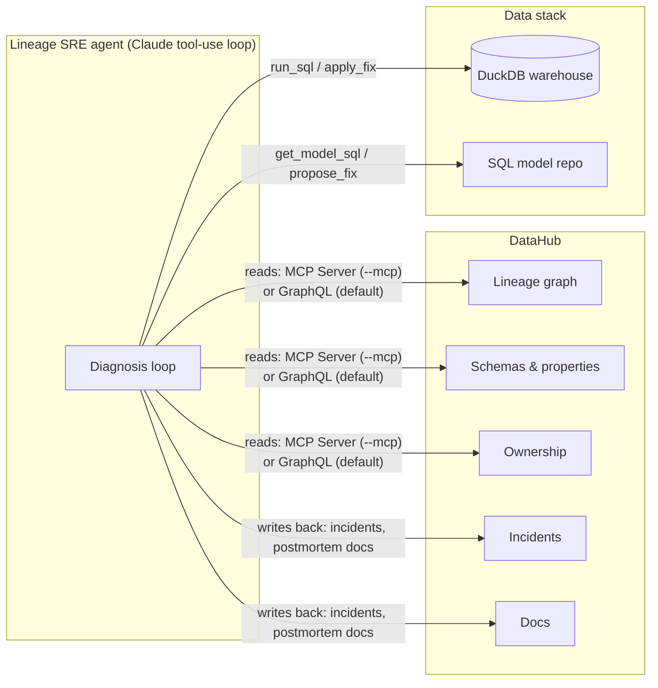

# Lineage SRE 🚨

**An autonomous incident-response agent for data pipelines, powered by DataHub.**

When a pipeline breaks at 3am, a human data engineer opens DataHub, walks the lineage graph upstream, diffs schemas, pings owners in Slack, patches the dbt model, and — if the team is lucky — writes a postmortem nobody can find six months later.

Lineage SRE is an AI agent that does all of that in about a minute, **and writes what it learned back into DataHub** so the next engineer (or the next agent) inherits the knowledge instead of re-diagnosing from scratch.

> Built for **Build with DataHub: The Agent Hackathon** — challenge tracks: *Agents That Do Real Work*, with strong overlap into *Metadata-Aware Code Generation* and *Production ML Agents*.

## The loop

```
detect ──> diagnose ──> fix ──> verify ──> write back
  │            │          │        │            │
  │      walks DataHub    │   re-runs the   raises a DataHub
health   lineage upstream,│   health check  incident + appends
check    diffs model SQL  │                 a postmortem to the
         vs live schemas  │                 asset docs in DataHub
                          │
                generates a contract-preserving
                SQL fix, validates it, applies it
```

Concretely, given a failing model the agent:

1. **Reproduces** the failure against the warehouse (DuckDB in the demo).
2. **Walks upstream lineage in DataHub** from the failing asset and, for each hop, compares what the model's SQL *expects* against the *current* schema in DataHub. A mismatch localizes the root cause (in the demo: a vendor silently renamed `amount_usd` → `amount` in the raw feed — the classic silent schema break).
3. **Measures the blast radius** by walking downstream lineage — including ML assets: the demo pipeline feeds a churn-model feature table and its scoring output, so the agent reports "your churn model is scoring on broken features" *before* it costs money.
4. **Identifies who to notify** from DataHub ownership metadata.
5. **Generates a minimal fix** that preserves the downstream contract (aliases the renamed column instead of propagating the rename), validates it with real SQL, writes it to `fixes/` as a reviewable artifact, and — with `--apply` — applies it and re-verifies the whole pipeline.
6. **Writes the knowledge back to DataHub**: raises a `DATA_SCHEMA` incident on the root-cause asset, appends a postmortem to the asset documentation, and resolves the incident only after the fix is verified. Open the dataset in the DataHub UI afterwards — the incident and postmortem are right there.

## Architecture



Two read modes, one write path:

| Mode | DataHub reads via | Notes |
|---|---|---|
| default | Built-in GraphQL tools | Zero extra deps, always works |
| `--mcp` | **Official [DataHub MCP Server](https://docs.datahub.com/docs/features/feature-guides/mcp)** (`mcp-server-datahub`) | Search, lineage, schemas, query analysis through the official server |

Write-back (incidents via `raiseIncident`, postmortems via `updateDescription`) always goes through DataHub's GraphQL API — the MCP server is read-focused, and contributing back to the graph is the point.

## Quickstart

Prereqs: [uv](https://docs.astral.sh/uv/) and a DataHub instance — either of:

- **DataHub Cloud free trial** (no Docker): sign up at [datahub.com/free-trial](https://datahub.com/free-trial/),
  generate a personal access token (Settings → Access Tokens), and set `DATAHUB_GMS_URL=https://<org>.acryl.io/gms`
  and `DATAHUB_TOKEN` in `.env`.
- **Local quickstart** (Docker): `uv tool install acryl-datahub && datahub docker quickstart`,
  then the default `DATAHUB_GMS_URL=http://localhost:8080` just works.

The agent runs on any of three backends (`--engine gemini|api|sdk`, auto-detected from `.env`):

| Engine | Needs | Cost |
|---|---|---|
| `gemini` | `GEMINI_API_KEY` ([free, no card](https://aistudio.google.com/apikey)) | free tier |
| `api` | `ANTHROPIC_API_KEY` | pay per token |
| `sdk` | a [Claude Code](https://claude.com/claude-code) login, no key | your Claude subscription |

```bash
# Install
git clone <this repo> && cd lineage-sre
uv sync                    # add: --extra mcp  for MCP mode
cp .env.example .env       # point it at your DataHub instance

# Run the whole story end-to-end
uv run lineage-sre demo
```

Or step by step:

```bash
uv run lineage-sre seed        # build the demo warehouse + ingest metadata into DataHub
uv run lineage-sre break       # the vendor ships feed v2: amount_usd -> amount 💥
uv run lineage-sre check       # health check: 3 of 4 models FAILING
uv run lineage-sre diagnose --apply         # the agent takes it from here
uv run lineage-sre diagnose --apply --mcp   # same, reading DataHub via the official MCP server
```

Then open http://localhost:9002, find `demo.raw_payments`, and look at the **Incidents** tab and the **Documentation** tab — the agent's work is in the graph.

## The demo pipeline

```
raw_payments  ──> stg_payments  ──> fct_daily_revenue        (exec dashboard)
raw_customers ──> stg_customers ──> churn_features ──> churn_model_predictions   (production ML)
                    stg_payments ──┘
```

Datasets, schemas, column-level types, lineage, two owners (data platform vs. analytics), and vendor feed metadata (`feed_version` custom property) are all ingested into DataHub by `seed`. The `break` command simulates the nightly ingestion picking up the vendor's silent rename — DataHub's schema for `raw_payments` updates, the downstream SQL doesn't, and everything from the exec dashboard to the churn model breaks.

## Sample outputs

The agent's artifacts are in [`examples/`](examples/):

- [`rca_report_example.md`](examples/rca_report_example.md) — a full RCA report as produced by the agent
- [`fix_stg_payments.sql`](examples/fix_stg_payments.sql) — a generated contract-preserving fix

Every real run also writes `reports/rca_<timestamp>.md` and `fixes/<model>.sql`.

## How this uses DataHub (for the judges)

**Reads** — lineage traversal (`searchAcrossLineage` / MCP lineage tools), schema inspection, ownership lookup, custom properties (vendor feed version is a diagnostic breadcrumb), dataset search.

**Writes back** — `raiseIncident` (typed `DATA_SCHEMA`, on the root-cause asset), `updateIncidentStatus` (resolved only after a verified fix), `updateDescription` (postmortem appended to asset docs). The graph is better after the agent ran than before: the incident history and the postmortem live on the assets themselves.

**Beyond out-of-the-box** — DataHub shows you lineage; Lineage SRE *operationalizes* it: lineage → root cause → contract-preserving fix → verified repair → institutional memory, autonomously.

## Repo layout

```
src/lineage_sre/
  agent.py           # Claude tool-use loop + RCA report
  tools.py           # tool definitions & dispatch (reads + write-back actions)
  datahub_client.py  # GraphQL reads, incidents, docs write-back, REST emitter
  mcp_bridge.py      # official DataHub MCP Server integration (--mcp)
  demo_stack.py      # demo pipeline metadata + break scenario
  warehouse.py       # DuckDB warehouse, health checks, guarded SQL
  cli.py             # seed / break / check / diagnose / demo
demo/models/         # the pipeline's SQL models (dbt-style)
examples/            # sample agent outputs for judges
docs/                # demo video script
```

## License

[Apache 2.0](LICENSE)
